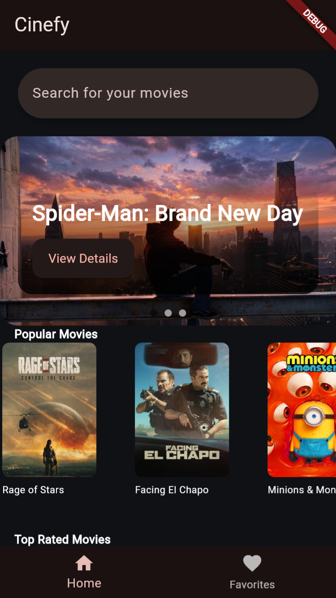
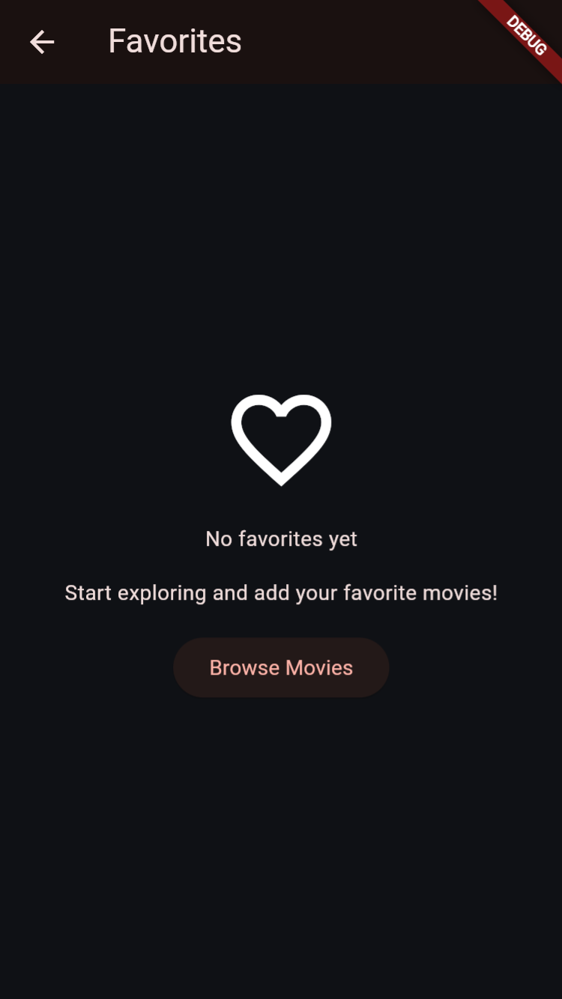
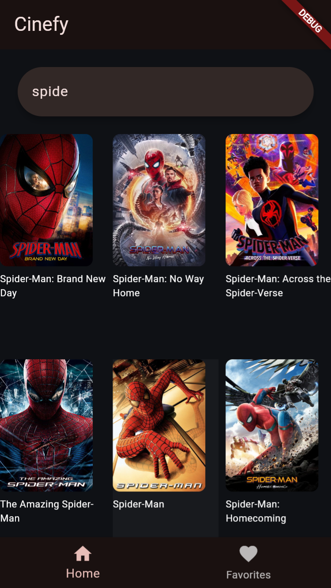
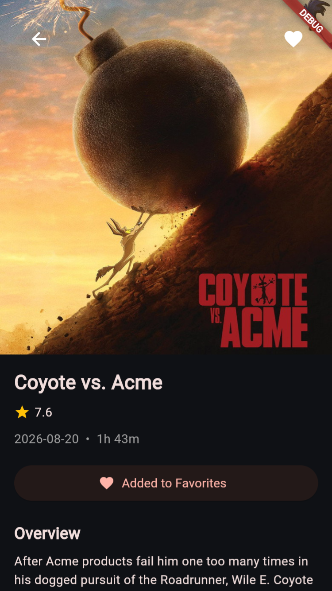

# Cinefy 🎬

Cinefy is a Flutter movie discovery application that allows users to explore popular and top-rated movies, search for movies, view movie details, and save their favorite movies.

## Features

- Browse popular movies.
- Browse top-rated movies.
- Search for movies by title.
- View movie details.
- Add and remove movies from favorites.
- Save favorites locally.
- Cache movie data for offline fallback.
- Loading states with shimmer effects.
- Error states with retry functionality.
- Empty search results handling.
- Responsive movie grid and horizontal movie lists.

## Screenshots

### Home Screen



### Favorites Screen



### Search Screen



### Movie Details Screen



## Technologies Used

- **Flutter**
- **Dart**
- **Riverpod** for state management
- **Dio** for API requests
- **TMDB API** for movie data
- **Hive** for local storage and caching
- **GoRouter** for navigation
- **Shimmer** for loading animations
- **flutter_dotenv** for environment variables

## Project Structure

```text
lib/
├── models/
│   └── movie.dart
├── providers/
│   └── movie_provider.dart
├── screens/
│   ├── home_screen.dart
│   ├── details_screen.dart
│   └── favorites_screen.dart
├── services/
│   ├── image_service.dart
│   └── tmdb_service.dart
├── repositories/
│   └── movie_repository.dart
├── widgets/
│   ├── movie_card.dart
│   ├── shimmer_movie_card.dart
│   ├── home_loading_shimmer.dart
│   └── error_state.dart
└── main.dart
```

## Getting Started

### 1. Clone the repository

```bash
git clone https://github.com/farahmohammedd/cinefy.git
```

### 2. Open the project

```bash
cd cinefy
```

### 3. Install dependencies

```bash
flutter pub get
```

### 4. Add your TMDB API key

Create a file named `.env` and add:

```env
TMDB_API_KEY=YOUR_TMDB_API_KEY
```

Do not upload your `.env` file to GitHub.

### 5. Run the application

For Chrome:

```bash
flutter run -d chrome
```

For Android:

```bash
flutter run
```

## API

Cinefy uses [The Movie Database API](https://developer.themoviedb.org/docs/getting-started) to retrieve movie information and poster images.

You need to create your own TMDB API key to run the application.

## Local Storage

Hive is used to store:

- Favorite movies.
- Popular movies cache.
- Top-rated movies cache.

If the API request fails, the application attempts to display cached movie data when available.

## State Management

Riverpod is used to manage:

- Popular movies state.
- Top-rated movies state.
- Search results.
- Favorites.
- Image service state.
- Loading and error states.

## Navigation

GoRouter is used to navigate between:

- Home screen.
- Movie details screen.
- Favorites screen.

## Error Handling

The application handles:

- Loading.
- Successful data loading.
- API errors.
- Retry actions.
- Empty search results.
- Cached data fallback.

## Future Improvements

- Add dark and light theme switching.
- Add more movie categories.
- Add movie trailers.
- Add pagination.
- Improve animations.
- Add automated tests.
- Improve responsive design.
- Publish the application.

